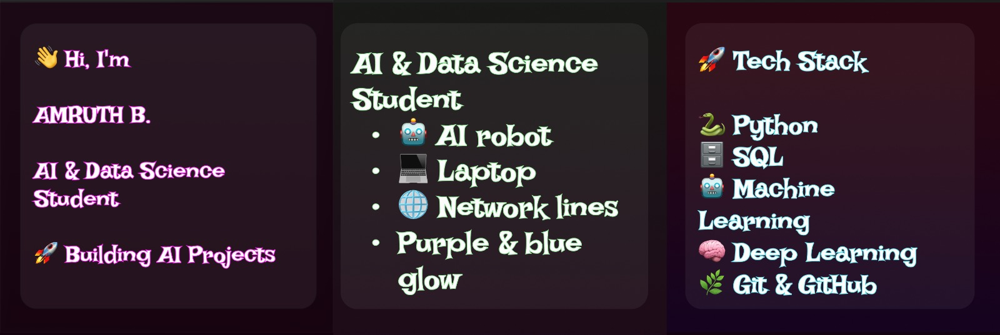

  

# 👋 Welcome to My GitHub!

## 👨‍💻 AMRUTH B

🎓 **B.Tech Artificial Intelligence & Data Science (AI & DS) Student**

Passionate about building intelligent solutions using Artificial Intelligence, Machine Learning, Deep Learning, Computer Vision, and Python. I enjoy solving real-world problems through innovative projects and continuously learning emerging technologies.

---

## 🚀 About Me

- 🎓 B.Tech Artificial Intelligence & Data Science (AI & DS)
- 🐍 Python Developer
- 🤖 Machine Learning & Deep Learning Enthusiast
- 👁️ Computer Vision Developer
- 📊 Exploring Data Science & Data Engineering
- 🌱 Always Learning New Technologies
- 🤝 Open to Internship & Collaboration Opportunities

---

## 🛠️ Tech Stack

- **Languages:** Python, SQL, C, HTML, CSS
- **Machine Learning:** Scikit-learn, TensorFlow, Keras
- **Deep Learning:** CNN, ANN, LSTM
- **Computer Vision:** OpenCV
- **Frameworks:** Flask, Streamlit, FastAPI
- **Databases:** MySQL, ChromaDB
- **Tools:** Git, GitHub, VS Code, Jupyter Notebook
- **Cloud:** AWS (Learning)

---

## 📂 Featured Projects

- 🔍 AI CCTV Person Search System
- 🛒 Automated Hypermarket
- 📄 AI Resume Analyzer
- ☁️ Cloud Resource Auto-Scaling using AI
- 💬 AI Career Path Advisor
- 🤖 RAG Website Chatbot

---

## 🏆 Certifications

- 🏅 AI Tools & ChatGPT Workshop – be10x
- 🏅 Become an Expert in HTML – Udemy
- 🏅 Machine Learning & AI Training
- 🏅 Python Programming Certifications

---

## 📊 GitHub Stats

> 📈 Showcasing my coding journey, project contributions, and continuous learning.

---

## 📫 Connect With Me

📧 **Email:** amruthbabu22@gmail.com

💼 **LinkedIn:** www.linkedin.com/in/amruth-b-388b87281

🐙 **GitHub:** https://github.com/Amruth2245
